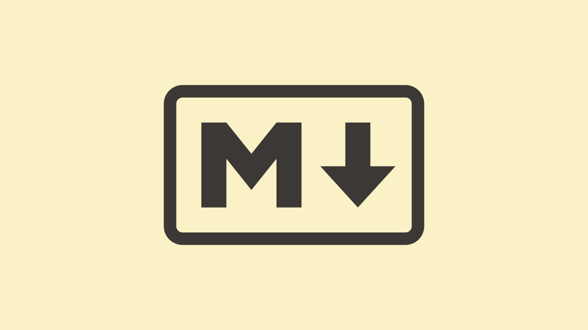

---

## 1. Headings

Use `#` symbols for headings. The number of `#` signs determines the level.

```markdown
# H1

## H2

### H3

#### H4
```

# H1

## H2

### H3

#### H4

## 2. Emphasis

Use asterisks or underscores:

- _Italic_ → `*Italic*` or `_Italic_`
- **Bold** → `**Bold**` or `__Bold__`
- **_Bold and Italic_** → `***Bold and Italic***`

## 3. Lists

### Unordered List

```markdown
- Item 1
- Item 2
  - Subitem 2.1
  - Subitem 2.2
```

- Item 1
- Item 2

  - Subitem 2.1
  - Subitem 2.2

### Ordered List

```markdown
1. First
2. Second
   1. Sub-step
```

1. First
2. Second

   1. Sub-step

## 4. Links

```markdown
[example.com](https://www.example.com)
```

[example.com](https://www.example.com)

## 5. Images

```markdown

```


## 6. Code

Inline code: `` `code` `` → Example: `print("Hello World")`

Code blocks:

<pre>
```python
def greet():
    print("Hello, Markdown!")
```
</pre>

```python
def greet():
    print("Hello, Markdown!")
```

## 7. Blockquotes

```markdown
> This is a blockquote.
```

> This is a blockquote.

> You know you’re getting old when you get that one candle on the cake. It’s 
> like, 'See if you can blow this out.'

## 8. Horizontal Rule

Three dashes, asterisks, or underscores:

```markdown
---
```

---

## 9. Tables

```markdown
| Name  | Role      |
| ----- | --------- |
| Alice | Developer |
| Bob   | Designer  |
```

| Name  | Role      |
| ----- | --------- |
| Alice | Developer |
| Bob   | Designer  |


## 10. Task Lists

````markdown
---

Use `- [ ]` for a checkbox.

```markdown
- [x] Write basic Markdown
- [ ] Learn advanced features
- [ ] Conquer the world
````

List of things I want to get done.
* [x] Write basic Markdown
* [ ] Learn advanced features
* [ ] Conquer the world


## 11. Footnotes

Add extra information without cluttering your main text.[^1]

```markdown
This is a sentence with a footnote.[^1]

[^1]: Here's the footnote!
```

[^1]: Here's the footnote!

## 12. Tables with Alignment

You can align text left, center, or right using colons (`:`).

```markdown
| Name     | Role       | Score |
|:---------|:----------:|------:|
| Alice    | Developer  |    95 |
| Bob      | Designer   |    87 |
| Charlie  | **Manager**|   100 |
```

| Name    |     Role    | Score |
| :------ | :---------: | ----: |
| Alice   |  Developer  |    95 |
| Bob     |   Designer  |    87 |
| Charlie | **Manager** |   100 |


## 13. Collapsible Sections (HTML only)

```html
<details>
  <summary>Click to expand!</summary>
  Hidden content goes here. You can include **Markdown** inside!
</details>
```

<details>
  <summary>Click to expand!</summary>
  Hidden content goes here. You can include **Markdown** inside!
</details>


## 14. Strikethrough

Use `~~text~~` to strike through.

```markdown
~~This text is crossed out~~
```

~~This text is crossed out~~

## 15. Inline HTML

Markdown allows some HTML:

```html
<b>Bold HTML</b> <i>Italic HTML</i> <span style="color:red">Red Text</span>
```

<b>Bold HTML</b> <i>Italic HTML</i> <span style="color:red">Red Text</span>

## 16. Math (LaTeX)

Use dollar signs for inline math: `$E = mc^2$`
Or double for blocks:

```markdown
$$
\int_0^\infty e^{-x^2} dx = \frac{\sqrt{\pi}}{2}
$$
```
inline: $E = mc^2$

$$
\int_0^\infty e^{-x^2} dx = \frac{\sqrt{\pi}}{2}
$$

## 17. Autolinks

URLs and emails become links automatically:

```markdown
https://www.example.com  
email@example.com
```

https://www.exmaple.com  
email@example.com

## 18. Alerts

```md
> [!NOTE]
> Useful information that users should know, even when skimming content.

> [!TIP]
> Helpful advice for doing things better or more easily.

> [!IMPORTANT]
> Key information users need to know to achieve their goal.

> [!WARNING]
> Urgent info that needs immediate user attention to avoid problems.

> [!CAUTION]
> Advises about risks or negative outcomes of certain actions.
```
> [!NOTE]
> Useful information that users should know, even when skimming content.

> [!TIP]
> Helpful advice for doing things better or more easily.

> [!IMPORTANT]
> Key information users need to know to achieve their goal.

> [!WARNING]
> Urgent info that needs immediate user attention to avoid problems.

> [!CAUTION]
> Advises about risks or negative outcomes of certain actions.

