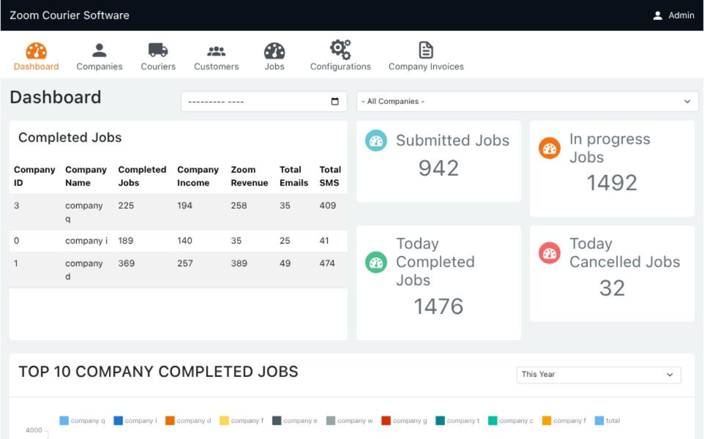

# Markdown Basics

Markdown is a lightweight markup language used to format text. It is commonly
used for documentation, README files, and notes. Here's a quick overview of its
main features:

---

## 1. Headings

Use `#` symbols for headings. The number of `#` signs determines the level.

```markdown
# H1

## H2

### H3

#### H4
```

## 2. Emphasis

Use asterisks or underscores:

- _Italic_ → `*Italic*` or `_Italic_`
- **Bold** → `**Bold**` or `__Bold__`
- **_Bold and Italic_** → `***Bold and Italic***`

## 3. Lists

### Unordered List

```markdown
- Item 1
- Item 2
  - Subitem 2.1
  - Subitem 2.2
```

- Item 1
- Item 2

  - Subitem 2.1
  - Subitem 2.2

### Ordered List

```markdown
1. First
2. Second
   1. Sub-step
```

1. First
2. Second

   1. Sub-step

## 4. Links

```markdown
[OpenAI](https://www.openai.com)
```

[OpenAI](https://www.openai.com)

## 5. Images

```markdown

```



## 6. Code

Inline code: `` `code` `` → Example: `print("Hello World")`

Code blocks:

<pre>
```python
def greet():
    print("Hello, Markdown!")
```
</pre>

```python
def greet():
    print("Hello, Markdown!")
```

## 7. Blockquotes

```markdown
> This is a blockquote.
```

> This is a blockquote.

> You know you’re getting old when you get that one candle on the cake. It’s 
> like, 'See if you can blow this out.'

## 8. Horizontal Rule

Three dashes, asterisks, or underscores:

```markdown
---
```

---

## 9. Tables

```markdown
| Name  | Role      |
| ----- | --------- |
| Alice | Developer |
| Bob   | Designer  |
```

| Name  | Role      |
| ----- | --------- |
| Alice | Developer |
| Bob   | Designer  |
